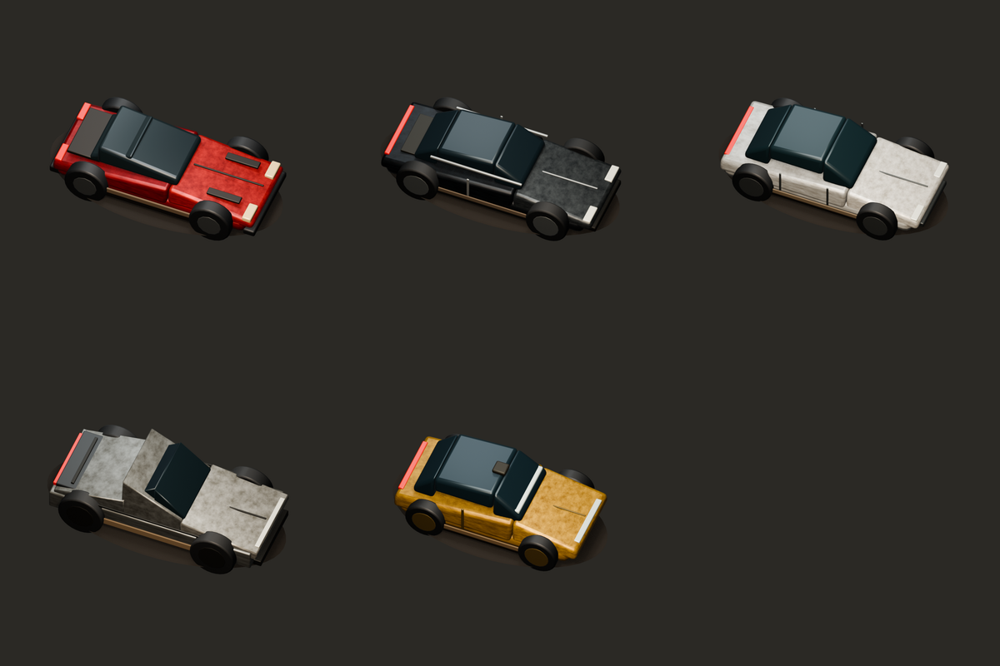
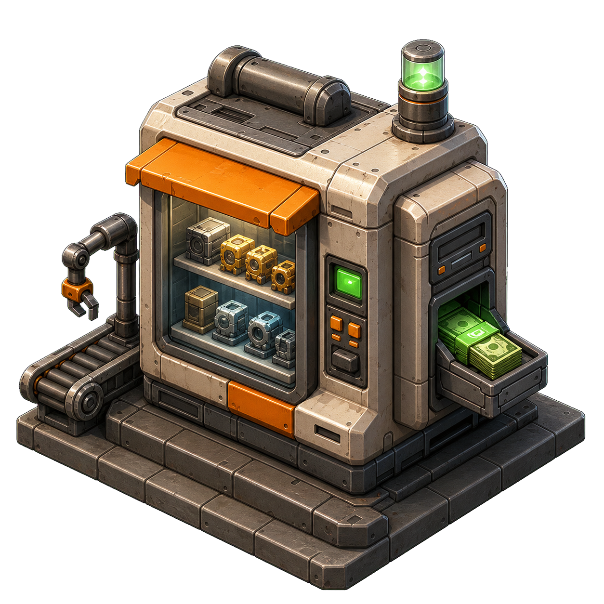
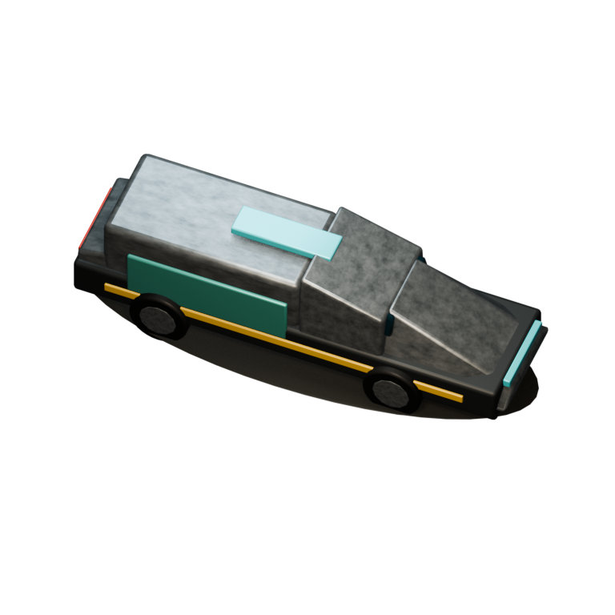
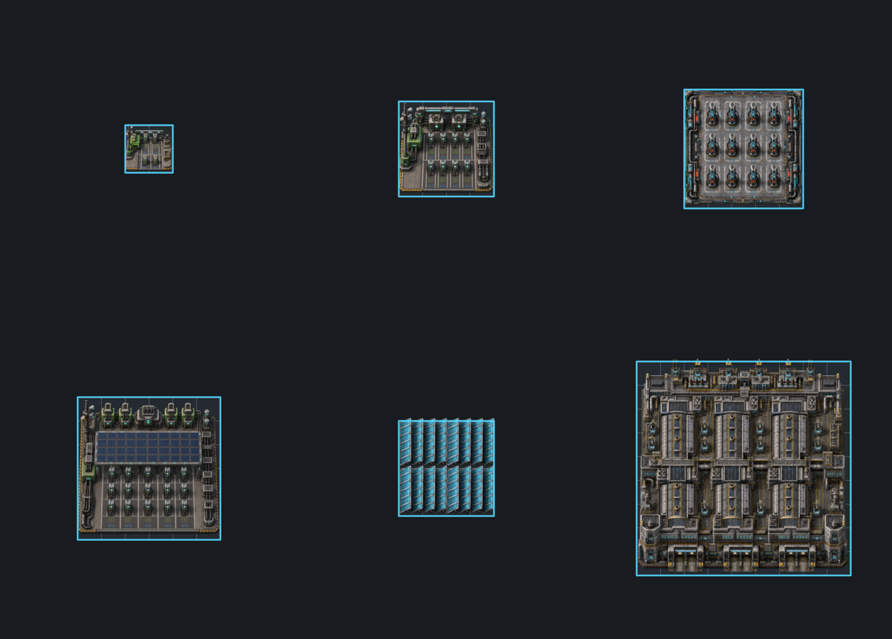

# Biter Motors

Biter Motors is a Factorio 2.1 Space Age overhaul mod about building an
electric-vehicle company on Nauvis. Turn biter settlements into customers,
scale batteries, charging, energy products, Robotaxis, and terrestrial AI,
then build orbital compute and train an AGI model.

`Biter Motors` is the official title used in-game and for the project. The
internal codename remains `factoryx`: the Factorio package lives at
`mod/factoryx_0.1.0`, the mod id is `factoryx`, and custom prototype ids use
the `x-` prefix. Keeping that technical identity stable preserves room for the
game to expand beyond vehicles and terrestrial industry.

## Artwork



<p align="center"><em>Prototype Roadster, Premium EV, Mass-market EV, Megatruck, and Robotaxi.</em></p>

<table>
  <tr>
    <td width="50%" align="center">
      
      <br><strong>Sales Office</strong>
    </td>
    <td width="50%" align="center">
      
      <br><strong>Cybertrain</strong>
    </td>
  </tr>
</table>



<p align="center"><em>Charging, solar, compute, and Gigafactory infrastructure at relative in-game scale.</em></p>

## Requirements

- Factorio 2.1
- Space Age
- Python 3 for static tests
- Pillow for artwork assertions
- `jq` for development installation

## Install

Link the development checkout into the normal macOS Factorio mods directory:

```bash
scripts/install-factoryx-mod.sh
```

To also link it into a separate headless-server mods directory:

```bash
FACTORIO_SERVER_MODS_DIR=/path/to/server/mods \
  scripts/install-factoryx-mod.sh
```

Factorio processes do not hot-reload mod source. Restart the game or server
after changing player-facing mod files.

## Validate

Run the static contract suite:

```bash
python3 -m unittest tests.test_factoryx_mod
```

Run the isolated Factorio smoke test:

```bash
scripts/validate-factoryx-mod.sh
```

Additional focused validators and scale benchmarks live in `scripts/`.

## Project Notes

- `factoryX.md` is the complete design and roadmap.
- `feature_specs/factoryx_battery_chemistry_branch.md` specifies the battery
  chemistry branch.
- `art/` contains source models, master renders, and QA pages.
- `mod/factoryx_0.1.0/README.md` documents implemented gameplay in detail.

This is a private development repository. No public license is granted.
