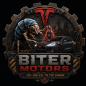

# Biter Motors

<p align="center">
  
</p>

**Build the company. Electrify the planet. Outgrow the sky.**

Biter Motors is a new Factorio 2.1 Space Age campaign about turning a failed
colony mission into an industrial empire. You arrive on Nauvis with a damaged
ship, a useful but finite cache of advanced equipment, and no sign of the
landing party that came before you. Their plans are gone. The factory is not.


<p align="center"><em>A crash landing is only the first funding round.</em></p>

## Astro-capitalism Starts Small

The opening still asks you to mine, automate, and survive, but your colony has a
different reason to grow. Reconstruct lost industrial capabilities. Put
recovered technology back into production. Build something the locals might
actually want.

Your first customers are also the reason ordinary engineers would have built
walls.

## An Unlikely Market

Biter settlements can become markets instead of targets. Reach them with Sales
Offices and powered charging infrastructure, then manufacture vehicles and
move the physical orders, products, and profit through your factory.

The relationship is useful, uneasy, and visible on the map. Customers consume
real capacity. Settlements grow. Service failures have consequences. Worms
remain unconvinced.

## Growth Has Consequences

Every successful product creates the next constraint. More customers need more
charging. More charging needs more electricity. More electricity needs better
generation, storage, materials, and factories. Capital can accelerate the
company, but it cannot repeal Factorio logistics.

You will build new battery supply chains, confront industrial waste, search
farther from home for strategic resources, and decide how aggressively to
scale before the grid catches up. The vehicles are not only products: climb
inside them, drive the roads you built, and discover why range, charging, and
durability matter.

## The Factory Becomes The Product

Eventually the small production line is no longer enough. Heavy manufacturing,
autonomous logistics, fleet services, high-density energy systems, and
electric freight change the shape of the base. The game keeps asking the same
Factorio question at a larger scale:

> Can you make the next order of magnitude routine?

## The Sky Becomes Real Estate

Terrestrial industry can create extraordinary wealth and computation, but land,
power, cooling, and public tolerance are finite. At some point the most
ambitious infrastructure belongs above Nauvis.

Biter Motors keeps the Space Age fantasy focused: one planet, its orbital
frontier, and the increasingly strange economics connecting them. The endgame
is there to be discovered, not itemized in this README.

## What Changes

- A purpose-built Nauvis-and-orbit campaign with a new industrial progression.
- Physical markets: products go in, Dollars come out, and both belong on belts.
- Biter settlements that can become customers without making the world safe.
- New drivable electric vehicles, charging networks, battery chemistry,
  factories, energy systems, fleet services, and terrestrial industry.
- A power curve that turns commercial success into an infrastructure problem.
- A fresh-start landing scene and recovered equipment that skip some familiar
  burner-era repetition without skipping the work of building a real factory.

Biter Motors is designed for a new world. Existing saves and compatibility
migrations are intentionally outside the current scope.

## Requirements

- Factorio 2.1
- Space Age
- Python 3 for static tests
- Pillow for artwork assertions
- `jq` for development installation

## Install

Link the development checkout into the normal macOS Factorio mods directory:

```bash
scripts/install-factoryx-mod.sh
```

To also link it into a separate headless-server mods directory:

```bash
FACTORIO_SERVER_MODS_DIR=/path/to/server/mods \
  scripts/install-factoryx-mod.sh
```

Factorio processes do not hot-reload mod source. Restart the game or server
after changing player-facing mod files.

## Validate

Run the static contract suite:

```bash
python3 -m unittest tests.test_factoryx_mod
```

Run the isolated Factorio smoke test:

```bash
scripts/validate-factoryx-mod.sh
```

Additional focused validators and scale benchmarks live in `scripts/`.

## Project Notes

- `Biter Motors` is the official player-facing title. The stable internal
  codename, Factorio mod id, package path, and prototype namespace remain
  `factoryx`, `mod/factoryx_0.1.0`, and `x-`.
- `factoryX.md` is the complete design and roadmap.
- `feature_specs/factoryx_battery_chemistry_branch.md` specifies the battery
  chemistry branch.
- `art/` contains source models, master renders, and QA pages.
- `mod/factoryx_0.1.0/README.md` documents implemented gameplay in detail.

This is a private development repository. No public license is granted.
