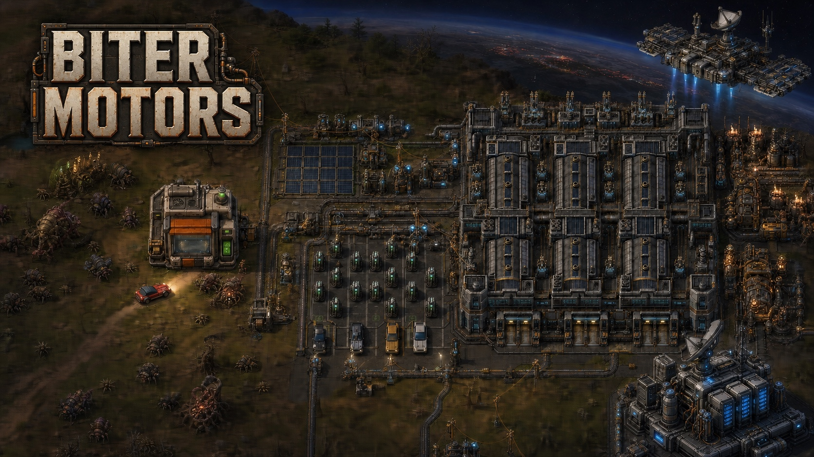
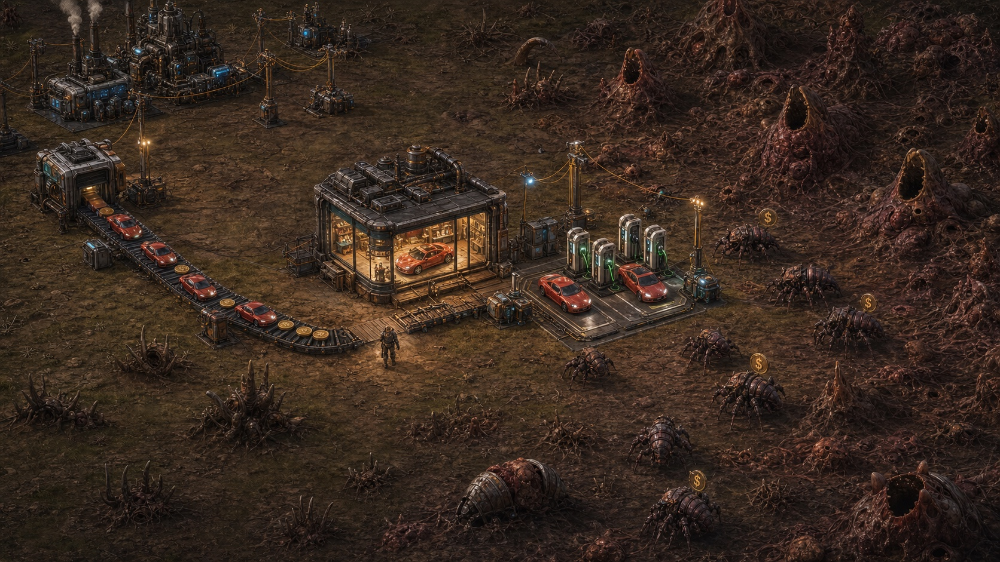
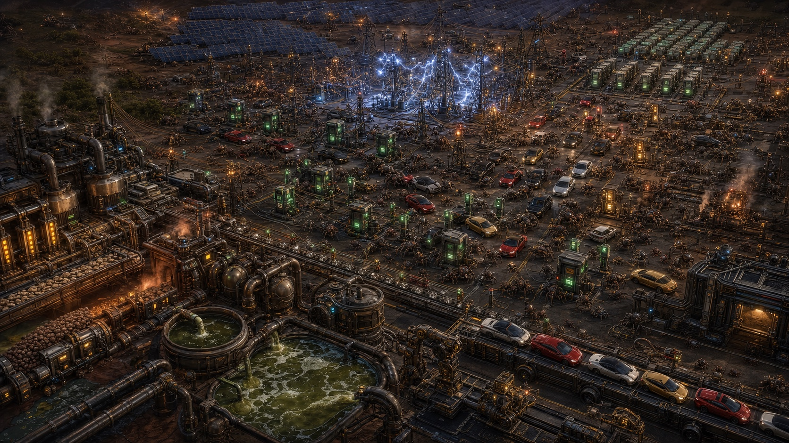
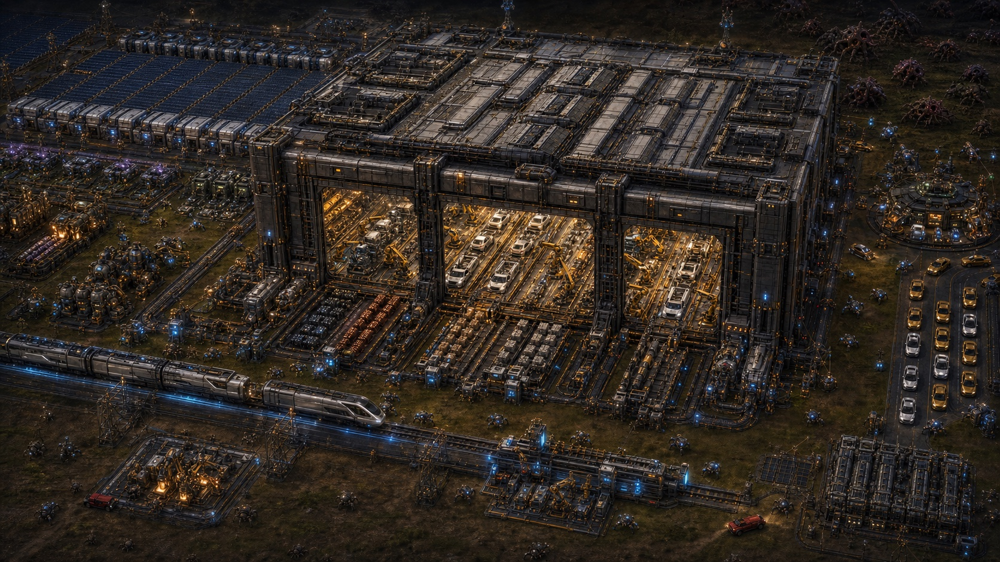
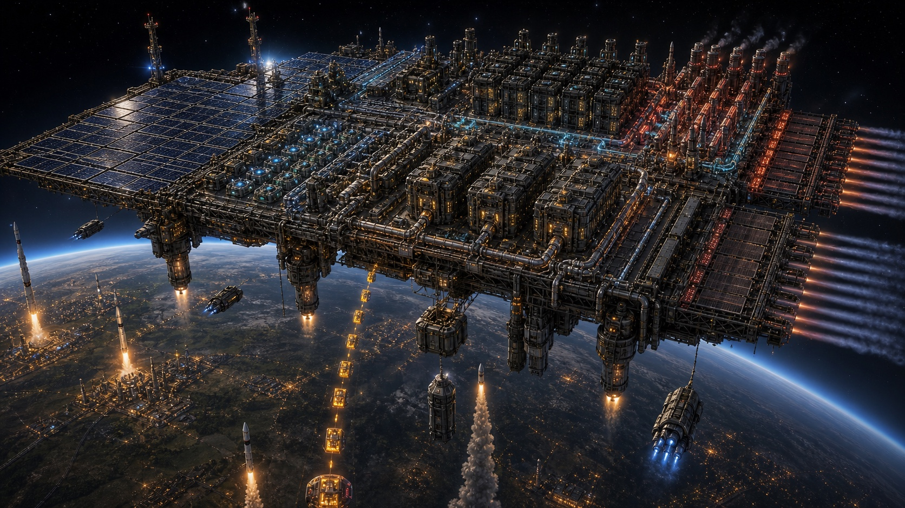

# Biter Motors



<p align="center"><em>Head office expects a factory. Nauvis has other plans.</em></p>


> [!WARNING]
> **Biter Motors is currently in alpha.** Expect balance changes, unfinished
> mechanics and artwork, and more late-game and end-game development.

**Build the company. Electrify the planet. Outgrow the sky.**

Biter Motors is an alpha Factorio 2.1 Space Age campaign about turning a
failed industrial expedition into an empire.

The boss sent you to Nauvis to help finish a factory launch. The advance landing
party was supposed to have power online, miners running, and the first
production lines waiting for you.

They never arrived.

There is no factory. No crew. No handover. Just a damaged ship, scattered
cargo, a finite cache of equipment, and a corporate objective that somehow
survived the crash.

The customers are not friendly.

Yet.

## The Brief Was Wrong

Recover what survived. Rebuild the industrial capabilities the landing party
was meant to establish. Put advanced equipment back into production before
Nauvis turns a bad launch into a write-off.

The only part of the original plan still intact is the expectation of growth.

## An Unlikely Market



Nauvis has a population. It also has teeth.

Biter settlements can become markets instead of targets, but only if you can
reach them, power the infrastructure, and survive the introduction. Build
something the locals might want, then move physical orders, vehicles, and
profit through the factory you were forced to create from nothing.

The relationship is useful, uneasy, and visible on the map. Customers consume
real capacity. Settlements grow. Service failures have consequences. Worms
remain unconvinced.

## Growth Has Consequences



Every successful product creates the next constraint. More customers need more
charging. More charging needs more electricity. More electricity needs better
generation, storage, materials, and factories. Capital can accelerate the
company, but it cannot repeal Factorio logistics.

You will build new battery supply chains, confront industrial waste, search
farther from home for strategic resources, and decide how aggressively to
scale before the grid catches up. The vehicles are not only products: climb
inside them, drive the roads you built, and discover why range, charging, and
durability matter.

## The Factory Becomes The Product



Eventually the small production line is no longer enough. Heavy manufacturing,
autonomous logistics, fleet services, high-density energy systems, and
electric freight change the shape of the base. The game keeps asking the same
Factorio question at a larger scale:

> Can you make the next order of magnitude routine?

## The Sky Becomes Real Estate



Terrestrial industry can create extraordinary wealth and computation, but land,
power, cooling, and public tolerance are finite. At some point the most
ambitious infrastructure belongs above Nauvis.

Biter Motors keeps the Space Age fantasy focused: one planet, its orbital
frontier, and the increasingly strange economics connecting them. The endgame
is there to be discovered, not itemized in this README.

## What Changes

- A purpose-built Nauvis-and-orbit campaign with a new industrial progression.
- Physical markets: products go in, Dollars come out, and both belong on belts.
- Biter settlements that can become customers without making the world safe.
- New drivable electric vehicles, charging networks, battery chemistry,
  factories, energy systems, fleet services, and terrestrial industry.
- A power curve that turns commercial success into an infrastructure problem.
- A fresh-start landing scene and recovered equipment that skip some familiar
  burner-era repetition without skipping the work of building a real factory.

Biter Motors is designed for a new world. The public save and mod-compatibility
contract is documented in [COMPATIBILITY.md](COMPATIBILITY.md).

## Requirements

- Factorio 2.1
- Space Age
- Python 3 for static tests
- Pillow for artwork assertions
- `jq` for development installation

## Install

Link the development checkout into the normal macOS Factorio mods directory:

```bash
scripts/install-bitermotors-mod.sh
```

To also link it into a separate headless-server mods directory:

```bash
FACTORIO_SERVER_MODS_DIR=/path/to/server/mods \
  scripts/install-bitermotors-mod.sh
```

Factorio processes do not hot-reload mod source. Restart the game or server
after changing player-facing mod files.

## Validate

Run the static contract suite:

```bash
python3 -m unittest tests.test_bitermotors_mod
```

Run the isolated Factorio smoke test:

```bash
scripts/validate-bitermotors-mod.sh
```

Additional focused validators and scale benchmarks live in `scripts/`.

## Project Notes

- `Biter Motors` is the official player-facing title. The stable internal
  codename, Factorio mod id, package path, and prototype namespace remain
  `bitermotors`, `mod/bitermotors_0.1.0`, and `bitermotors-`.
- `ROADMAP.md` is the authoritative design and public-release roadmap.
- `COMPATIBILITY.md` defines supported worlds, upgrades, and mod boundaries.
- `feature_specs/biter-motors-battery-chemistry.md` specifies the battery
  chemistry branch.
- `art/` contains source models, master renders, and QA pages.
- `mod/bitermotors_0.1.0/README.md` documents implemented gameplay in detail.

This is a private development repository. No public license is granted.
